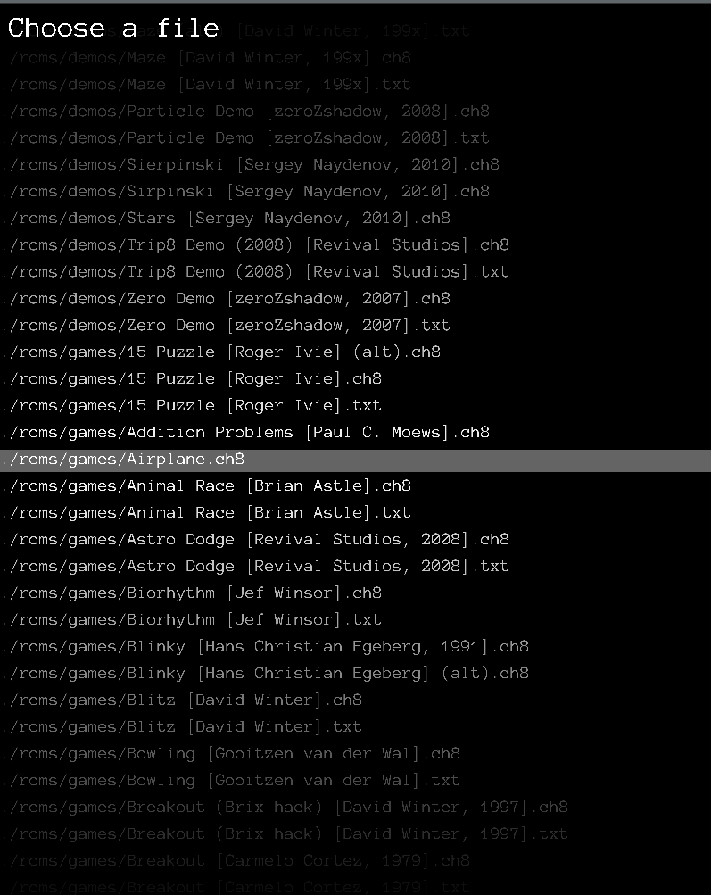
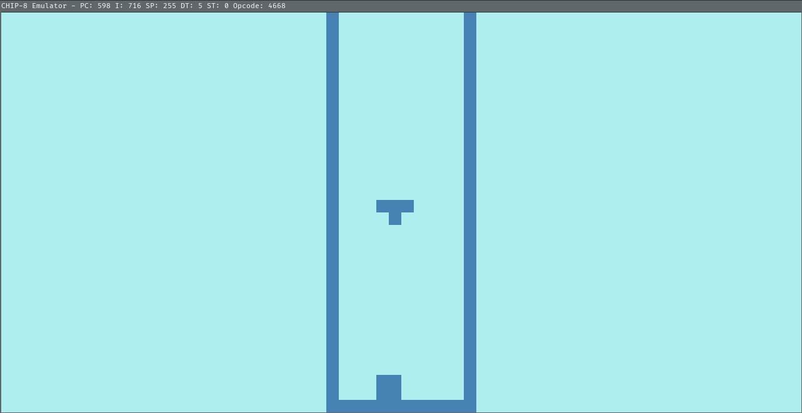
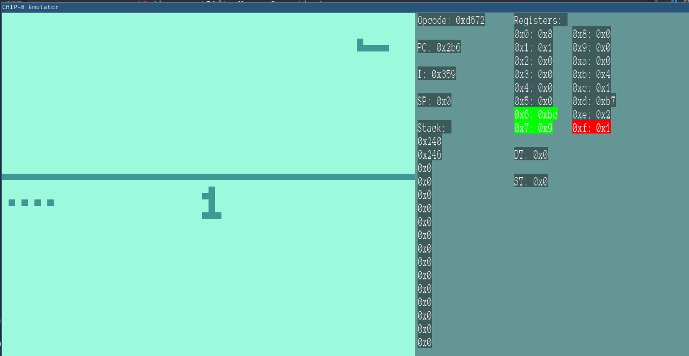

# CHIP-8_emulator
CHIP-8 emulator with debug view. Written in C++ using SDL2.

## Compiling and running
Requires SDL2, SDL2_ttf and ncurses

On a Debian-based system they can be installed by running the command:
~~~
sudo apt install libsdl2-dev libsdl2-ttf-dev libncurses-dev
~~~

## Usage
Note:
> I will refer to the ROM files as ROM or program in this documentation.

### Select a CHIP-8 ROM
When you start the emulator, the ROM selector opens. It shows the ROMs in the ./roms directory and in its subdirectories. You can copy your own ROMs here.

When you selected the ROM using the arrow keys, press Enter. An another dialog will open.

You can cancel the selection by pressing the Escape key.

### Select the emulation speed
After you selected the file, the emulation speed asker dialog opens.

Here you can enter the emulation speed. The default value is 500 instructions per second. This is multiplied by the entered value, so if you enter 1.5 it is 500 * 1.5 = 750 instructions.

If you press enter without entering a number, the default value is used.

You can cancel the operation by pressing the Escape key.

### Using the emulator
After you select the ROM and enter the speed, the emulator window opens. There you can see the output of the ROM.

### The title
The debug title is **disabled** by default (because it caused high CPU usage).
You can enable it by defining the *ENABLE_DEBUG_TITLE* macro in a source file.

In the title bar you can see the text CHIP-8 Emulator and some useful informations. If the program is currently running, you can see the program counter, index register, the stack pointer, the delay timer, sount timer and the currently executed opcode.

If the program is waiting for input, it is indicated as *waiting for keypress*

If the user paused the program, there is *[PAUSED]* at the end of the title.

### The window content
The window displays the output of the executed ROM. The programs can draw on a 64 px width and 32 px height buffer. The coordinates are scaled up so the output fills the window with fixed ratio.

The content can flicker, this is due to how the CHIP-8 interpreter is designed.

### Keys

#### Keypad
The CHIP-8 can accept 16 (0xF) keys by design.

The original keypad:

    1 2 3 c
    4 5 6 d
    7 8 9 e
    a 0 b f

This is how the keys are mapped to the (US) keyboard:

    1 2 3 4
    q w e r
    a s d f
    z x c v

#### Function keys

##### Escape
Pauses the program. Press again to resume. Disables stepping mode if it is active.

When paused, the emulator dims the colors.

##### F5
Enables stepping mode. Disables paused mode if active.

##### F6
Executes an instruction in stepping mode. No effect if stepping mode is not active.

##### F9
Hides/Shows the mouse cursor.

##### F10
Enables debug mode.

In debug mode you can see the currently executed opcode, the program counter,
the index register, the stack pointer, the content of the stack, the register values,
the delay and the sound timers. If the program reads from a register, its background is green
colored, if the program writes to it, it is red colored. It is also displayed when a program
reads which key is pressed.

All the values are displayed as hexadecimal with the 0x prefix.

##### F11
Toggles the fullscreen mode.

##### F12
Closes the emulator.

## License
Licensed under the MIT license.
